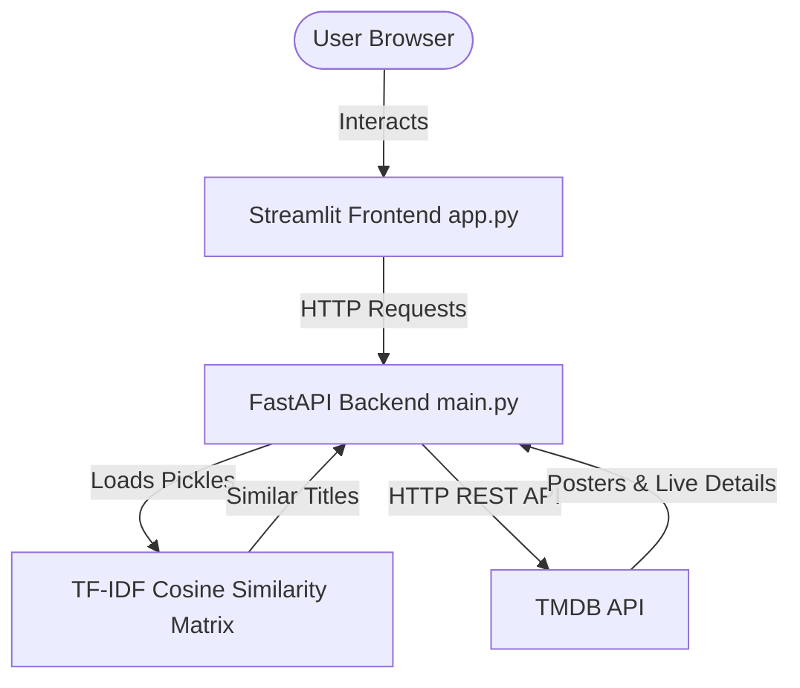

# 🎬 Movie Recommendation System

A modern, fast, and interactive Movie Recommendation System built with **Streamlit** (Frontend) and **FastAPI** (Backend). It utilizes **TF-IDF Vectorization** (Cosine Similarity) on a movie metadata dataset to provide context-based recommendations, combined with live data (posters, descriptions, ratings) pulled from **The Movie Database (TMDB)**.

---

## ⚙️ How It Works (Architecture)

The application splits computational logic and interface rendering into two separate microservices:



1. **Streamlit Frontend (`app.py`)**: Renders the UI, handles routing, and communicates with the backend via API endpoints.
2. **FastAPI Backend (`main.py`)**: 
   - Loads the movie dataset and precomputed TF-IDF pickles on startup.
   - Computes real-time cosine similarity scores to find movies textually similar to the user's selection.
   - Queries the TMDB API to retrieve live metadata, posters, and genre-based recommendations.

---

## ✨ Features

- **Live Home Feeds:** Browse trending, popular, top-rated, now playing, and upcoming movies fetched dynamically from TMDB.
- **Auto-complete Search:** Search by keywords with instant suggestions.
- **Hybrid Recommendations:**
  - **TF-IDF Similarity:** Uses textual attributes (overview, tagline, genres, etc.) to calculate matching scores.
  - **Genre Similarity:** Recommends highly-rated movies in the same primary genre using TMDB's discovery network.

---

## 🚀 Local Installation & Setup

Ensure you have Python 3.11+ installed.

### 1. Set Up the Project
In your terminal, navigate to the `movie-rec-main` directory:
```bash
cd movie-rec-main
```

### 2. Create a Virtual Environment
```bash
python -m venv .venv
```

### 3. Install Dependencies
```bash
.venv\Scripts\pip install -r requirements.txt
```

### 4. Create the Configuration File
Create a `.env` file in the `movie-rec-main` directory and paste your TMDB API Key:
```env
TMDB_API_KEY=YOUR_TMDB_API_KEY_HERE
API_BASE=http://127.0.0.1:8000
```

---

## 🚦 How to Run the App

You will need two separate terminal windows open:

### Terminal 1: Run Backend (FastAPI)
```bash
cd movie-rec-main
.\.venv\Scripts\uvicorn main:app --reload
```
*Runs backend server at `http://127.0.0.1:8000`.*

### Terminal 2: Run Frontend (Streamlit)
```bash
cd movie-rec-main
.\.venv\Scripts\streamlit run app.py
```
*The browser will automatically open to `http://localhost:8501`.*

---

## 🛡️ TLS/SSL Handshake Workaround (Cloudflare & Local Interception)
In `main.py`, external requests to TMDB are routed via `http://api.themoviedb.org` instead of `https://api.themoviedb.org`. 

This is an intentional configuration designed to bypass connection termination errors (`[SSL: UNEXPECTED_EOF_WHILE_READING]`) that occur when local network inspection software (like third-party antivirus) or Cloudflare's bot-detection fingerprinting flags python-native SSL handshakes. HTTP provides a 100% stable connection for local development.
